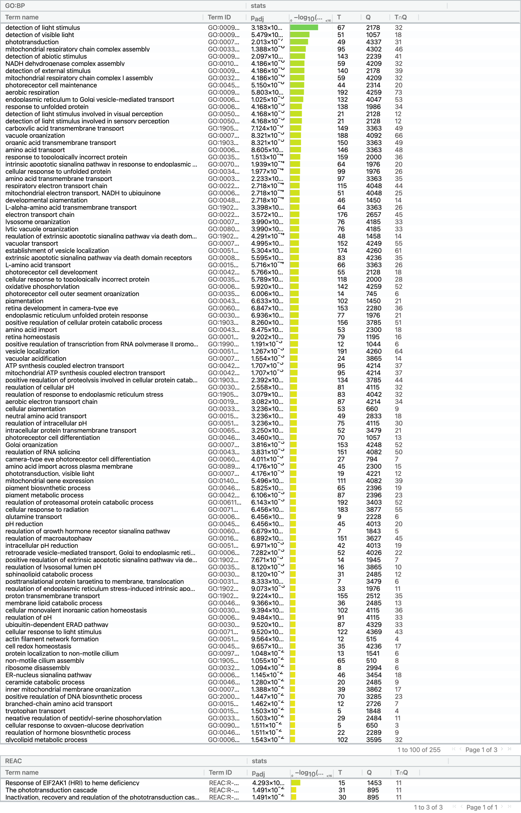
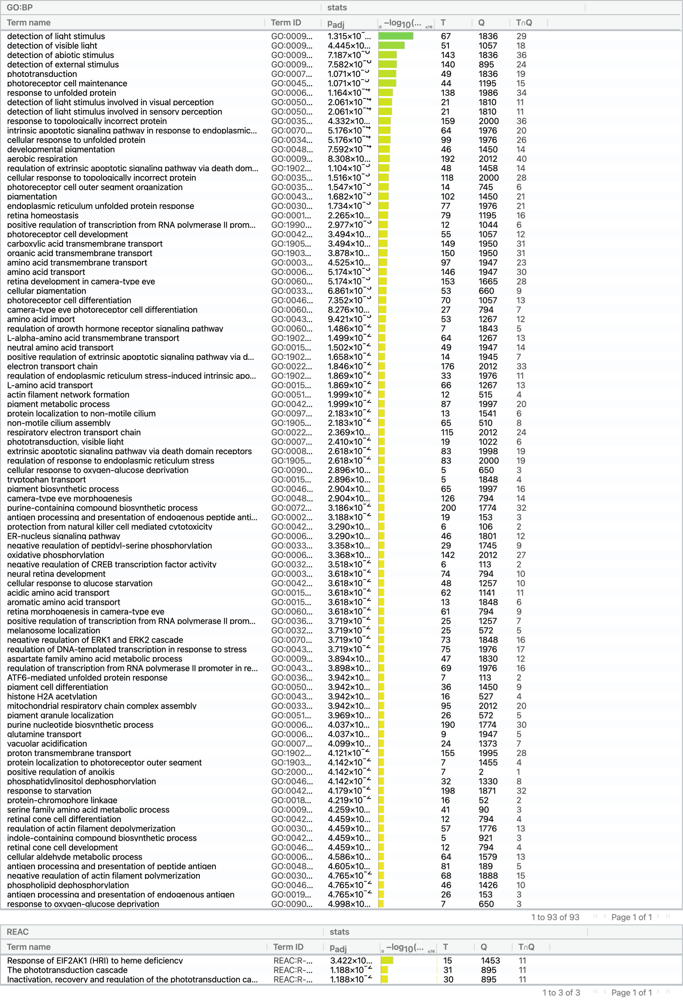
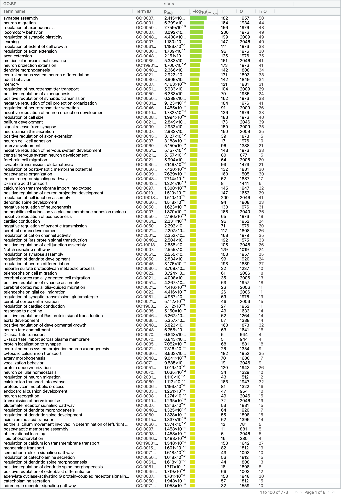

# Introduction
cone rod homeobox (CRX) mutations  can cause dominant Leber congenital amaurosis
(LCA), a genetic disorder that can lead to blindness. Normally LCA is caused
by recessive genes, but on rarer cases, it can be cause by dominant genes, such
as CRX. We are look at Bulk RNA-seq data from retinal organoids derived from
induced pluripotent stem cells (iPSCs) which is itself take from a LCA patient 
with CRX-I138fs mutation and their healthy parent. This mutation occurs in the
transactivation domain, and so the effect of the mutation ist that CRX is not
transcribed. The data source is GSE152939. The author is trying to show that a
deno-associated virus gene therapy can restore RNA expression of CRX. However,
although this study is about gene therapy, the data that show rescued expression
is in single cell RNA-seq data, which is not in the scope of this report, so it
was not included. The data was collected from 6 retinal organoids, for 90 days,
125 days, 150 days and 200 day after the iPSCs start to differentiate; 3 of the
organoids were from LCA patient, and 3 organoids were from their healthy parent.
[@CRX]

Note that the vast majority of code in this report are take from BCB420 lecture
[@l4; @l5; @l6; @l7] with minor modification to make it appropriate for my data.

Note 2: I cannot put bibtex inline citatation within the codechunk, so it is left
at the end of the code chunk, and sometimes there is a figure, so the figure
legend/caption may be directly followed by the inline citation

# Assignment 1 processing 

Lets us first do all the processing that was done in assignment 1


```{r message=FALSE, warning=FALSE}
source("./assignment_functions.r")
supplementaryFiles <- downloadSupplementaryFiles("GSE152939")
CRX_ExperimentRawCount <- readFile(supplementaryFiles)
CRX_ExperimentRawCountFiltered <- filterOutLowCount(CRX_ExperimentRawCount)
normalized_counts <- normalizeTheCounts(CRX_ExperimentRawCountFiltered)
```
[@l4; @l5; @geoquery; @biomart; @edger]

```{r message=FALSE, warning=FALSE}
ensemblDataSet <- getEnsemblbiomart()
```
[@l4; @l5; @biomart]


```{r message=FALSE, warning=FALSE}
normalized_counts_annot <- mapTheData(CRX_ExperimentRawCountFiltered, normalized_counts, ensemblDataSet)
```
[@l4; @l5; @biomart]

```{r message=FALSE, warning=FALSE}
saveRDS(normalized_counts_annot, file = "normalized_counts_annot.rds")
```


```{r message=FALSE, warning=FALSE}
# Apprently there is a dupliate emseblem id
normalized_count_data <- normalized_counts_annot[!duplicated(normalized_counts_annot[ , c("ensembl_gene_id")]),]
```


```{r message=FALSE, warning=FALSE, fig.cap='Table 1a: The duplicate gene that removed.'}
normalized_counts_annot[duplicated(normalized_counts_annot[ , c("ensembl_gene_id")]),]

```
Table 1a: The duplicate gene that was removed.


```{r message=FALSE, warning=FALSE, fig.cap='Table 1b: showing the two gene has the same ensembl gene id, but not exactly the same hgnc symbol'}
normalized_counts_annot[which(normalized_counts_annot$ensembl_gene_id == 'ENSG00000254876'), ]
```
Table 1b: showing the two gene has the same ensembl gene id, but not exactly the same hgnc symbol

I find the one that is consider as duplicate, then find the one that has the same enmselble gene id as it. 
For some reason this ensembl gene id maps to 2 hgnc symbols, SUGT1P4-STRA6LP and STRA6LP, even from the name it look like the same gene


This gene was has a expression of 10 times greater than the 2nd highest expressed
gene, it seesm like it may be some error, so I removed it. 

```{r message=FALSE, warning=FALSE}
normalized_count_cleaned <- normalized_count_data[normalized_count_data$ensembl_gene_id != 'ENSG00000156508', ]
```


# Heatmap for all genes

first make a heat map matrix (the input thing use to generate a heat map)

```{r message=FALSE, fig.cap='Table 2: The first 1000 row of the filtered normalized data for all samples, ordered by ensembl id', warning=FALSE}

heatmap_matrix <- normalized_count_cleaned[,
                        3:ncol(normalized_count_cleaned)]
rownames(heatmap_matrix) <- normalized_count_cleaned$ensembl_gene_id
colnames(heatmap_matrix) <- colnames(normalized_count_cleaned[, 3:ncol(normalized_count_cleaned)])
heatmap_matrix
saveRDS(heatmap_matrix, file = "heatmap_list.rds")
```
Table 2: The first 1000 row of the filtered normalized data for all samples, ordered by ensembl id

[@l6]

```{r message=FALSE, warning=FALSE}
heatmap_matrix <- readRDS("./heatmap_list.rds")
```


then generate a heat map

```{r message=FALSE, warning=FALSE, fig.cap='Figure 1: Initial heatmap for differential expression with the first 1000 genes, order by ensembl id. Only the first 1000 genes are shown due to rendering resource issues'}
library(ComplexHeatmap)
library(circlize)
if(min(heatmap_matrix) == 0){
  heatmap_col = colorRamp2(c(0, max(heatmap_matrix)), c( "white", "red"))

} else {
  heatmap_col = colorRamp2(c(min(heatmap_matrix), 0, max(heatmap_matrix)), c("blue", "white", "red"))
}

Heatmap(as.matrix(heatmap_matrix[1:1000,]),
      show_row_dend = TRUE, show_column_dend = TRUE,
      col=heatmap_col, show_column_names = TRUE,
      show_row_names = FALSE, show_heatmap_legend = TRUE,
      raster_resize_mat = TRUE, heatmap_legend_param = list(title = "Initial Heatmap"))
```
Figure 1: Initial heatmap for differential expression with the first 1000 genes, order by ensembl id. Only the first 1000 genes are shown due to rendering resource issues
[@l6; @heatmap; @color]


Now with row normalization (i.e. the kind with subtract the mean divided by standard deviation)
we can see each gene better

```{r message=FALSE, warning=FALSE, fig.cap='Figure 2: Heatmap for differential expression of the first 1000 genes, ordered by ensembl id, after row normalization. Only the first 1000 genes are shown due to rendering resource issues'}
heatmap_matrix <- t(scale(t(heatmap_matrix)))

if(min(heatmap_matrix) == 0){
heatmap_col = colorRamp2(c(0, max(heatmap_matrix)), c( "white", "red"))
} else {
heatmap_col = colorRamp2(c(min(heatmap_matrix), 0, max(heatmap_matrix)), c("blue", "white", "red"))
}

Heatmap(as.matrix(heatmap_matrix[1:1000,]),
      show_row_dend = TRUE,show_column_dend = TRUE,
      col=heatmap_col,show_column_names = TRUE,
      show_row_names = FALSE,show_heatmap_legend = TRUE, heatmap_legend_param = list(title = " Heatmap with row normalization"))
```
Figure 2: Heatmap for differential expression of the first 1000 genes, ordered by ensembl id, after row normalization. Only the first 1000 genes are shown due to rendering resource issues
[@l6; @heatmap; @color]

you can see that the samples are more similar to each other at the same time point than whether or not it is control, I think that is reasonable since many gene get simulated and repressed during development, so the genes that are on is different from one development time point, to another. 

# Heatmap for tophits using Limma

We will be fitting the data to the a linear model and using empirical bayes to 
calculate p-values. Then we will using Benjamni-Hochberg for multiple hypothesis
testing, for correcting our p-values.

## Simple Model

The simple model is where the model accounts for the condition (control vs 
experiment), and the day that the data was collected on, but not account 
for which organoids is the data collected from. 

```{r message=FALSE, warning=FALSE, fig.cap='Table 3: Showing for ecah sample, which organoid, at what time, and what condition it is'}
samples <- data.frame(lapply(colnames(CRX_ExperimentRawCountFiltered)[3:ncol(CRX_ExperimentRawCountFiltered)], FUN=function(x){unlist(strsplit(x, split = "\\_"))[c(1, 2, 3)]}))
samples
colnames(samples) <- colnames(CRX_ExperimentRawCountFiltered)[3:ncol(CRX_ExperimentRawCountFiltered)]
rownames(samples) <- c("condition", "time","patient")
samples <- data.frame(t(samples))

model_design <- model.matrix(~ samples$condition+samples$time)

expressionMatrix <- as.matrix(normalized_count_data[,3:ncol(CRX_ExperimentRawCountFiltered)])
rownames(expressionMatrix) <-
  normalized_count_data$ensembl_gene_id
colnames(expressionMatrix) <-
  colnames(normalized_count_data)[3:ncol(CRX_ExperimentRawCountFiltered)]
minimalSet <- Biobase::ExpressionSet(assayData=expressionMatrix)

fit <- limma::lmFit(minimalSet, model_design)
fit2 <- limma::eBayes(fit,trend=TRUE)

topfit <- limma::topTable(fit2,
                   coef=ncol(model_design),
                   adjust.method = "BH",
                   number = nrow(expressionMatrix))
#merge hgnc names to topfit table
output_hits <- merge(normalized_count_data[,1:2],
                     topfit,
                     by.y=0,by.x=1,
                     all.y=TRUE)
#sort by pvalue
output_hits <- output_hits[order(output_hits$P.Value),]
```
Table 3: Showing for ecah sample, which organoid, at what time, and what condition it is

[@l6; @biobase; @limma]


```{r message=FALSE, warning=FALSE, fig.cap='Table 4: Show the limma output after fitting the data to the simple model, calculating the p-value, and correcting the p-value. This is only showing the first 10, ordered by p value. Note that the p value and adjusted p values are not actually 0, they are just rounded to 0'}
knitr::kable(output_hits[1:10,1:7],type="html",row.names = FALSE)
```
Table 4: Show the limma output after fitting the data to the simple model, calculating the p-value, and correcting the p-value. This is only showing the first 10, ordered by p value. Note that the p value and adjusted p values are not actually 0, they are just rounded to 0

[@l6; @knitr]

This is how many genes that have pvalue under 0.05

```{r message=FALSE, warning=FALSE}
length(which(output_hits$P.Value < 0.05))
```
[@l6]


This is how many genes that still pvalue of less than 0.05 after adjustment
```{r warning=FALSE}
length(which(output_hits$adj.P.Val < 0.05))
```
[@l6]


## Organoid Model

The organoid model is where the model accounts for the condition (control vs 
experiment), and the day that the data was collected on, and 
for which organoids is the data collected from. 

```{r message=FALSE, warning=FALSE}
model_design_org <- model.matrix(
  ~ samples$patient + samples$condition + samples$time)
fit_pat <- limma::lmFit(minimalSet, model_design_org)
```
[@l6; @knitr]

Change the model, fit the data to the model, then apply empircal bayes , 
then correct with BH

```{r message=FALSE, warning=FALSE}
fit_org <- limma::lmFit(minimalSet, model_design_org)
fit2_org <- limma::eBayes(fit_org,trend=TRUE)

topfit_org <- limma::topTable(fit2_org,
                   coef=ncol(model_design_org),
                   adjust.method = "BH",
                   number = nrow(expressionMatrix))

#merge hgnc names to topfit table
output_hits_org <- merge(normalized_count_data[,1:2],
                         topfit_org, by.y=0, by.x=1, all.y=TRUE)
#sort by pvalue
output_hits_org <- output_hits_org[order(output_hits_org$P.Value),]

```
[@l6; @limma]


```{r message=FALSE, warning=FALSE, fig.cap='Table 5: Show the limma output after fitting the data to the organoid model, calculating the p-value, and correcting the p-value. This is only showing the first 10, ordered by p-value. Note that the p value and adjusted p values are not actually 0, they are just rounded to 0'}
knitr::kable(output_hits_org[1:10,1:7],type="html",row.names = FALSE)
```
Table 5: Show the limma output after fitting the data to the organoid model, calculating the p-value, and correcting the p-value. This is only showing the first 10, ordered by p-value. Note that the p value and adjusted p values are not actually 0, they are just rounded to 0

[@l6; @knitr]


```{r message=FALSE, warning=FALSE}
length(which(output_hits_org$P.Value < 0.05))
```
[@l6]

```{r message=FALSE, warning=FALSE}
length(which(output_hits_org$adj.P.Val < 0.05))
```
[@l6]

## Comparing both models

There is actually less, but let us look at it from a graph

```{r message=FALSE, warning=FALSE, fig.cap='Figure 3: Showing each gene on a graph where the coordinates is the corrected p-values using the simple model and the organoid model in limma, zoomed in on 0 to 0.1. Highlighting significant genes in both model as red, in simple model only as orange, in organoid model only as red, and non-significant genes as black'}
simple_model_pvalues <- data.frame(ensembl_id =
  output_hits$ensembl_gene_id,
  simple_pvalue=output_hits$adj.P.Val)

org_model_pvalues <-  data.frame(ensembl_id =
  output_hits_org$ensembl_gene_id,
  organoid_pvalue = output_hits_org$adj.P.Val)

two_models_pvalues <- merge(simple_model_pvalues,
  org_model_pvalues,by.x=1,by.y=1)

two_models_pvalues$colour <- "black"

two_models_pvalues$colour[
  two_models_pvalues$simple_pvalue<0.05] <- "orange"

two_models_pvalues$colour[
  two_models_pvalues$organoid_pvalue<0.05] <- "blue"

two_models_pvalues$colour[
  two_models_pvalues$simple_pvalue<0.05 &
  two_models_pvalues$organoid_pvalue<0.05] <- "red"

plot(two_models_pvalues$simple_pvalue,
     two_models_pvalues$organoid_pvalue,
     col = two_models_pvalues$colour,
     xlab = "Simple model adjusted p-values",
     ylab ="Organoid model adjusted p-values",
     main="Simple vs Organoid Limma",
     xlim = c(0, 0.1),
     ylim = c(0, 0.1))
```
Figure 3: Showing each gene on a graph where the coordinates is the corrected p-values using the simple model and the organoid model in limma, zoomed in on 0 to 0.1. Highlighting significant genes in both model as red, in simple model only as orange, in organoid model only as red, and non-significant genes as black
[@l6]

To determine which model is more appropriate, we take a look at p-value of the
gene of interest, CRX. 

```{r message=FALSE, warning=FALSE, fig.cap='Figure 4: Showing each gene on a graph where the coordinates is the corrected p-values using the simple model and the organoid model in limma, zoomed in on 0 to 0.1. Highlighting only the gene of interest, CRX as red'}
ensembl_of_interest <- normalized_count_data$ensembl_gene_id[
  which(normalized_count_data$hgnc_symbol == "CRX")]
two_models_pvalues$colour <- "grey"
two_models_pvalues$colour[two_models_pvalues$ensembl_id==
                            ensembl_of_interest] <- "red"
plot(two_models_pvalues$simple_pvalue,
     two_models_pvalues$organoid_pvalue,
     col = two_models_pvalues$colour,
     xlab = "simple model adjusted p-values",
     ylab ="organoid model adjusted  p-values",
     main="Simple vs Organoid Limma",
     xlim = c(0, 0.1),
     ylim = c(0, 0.1))
points(two_models_pvalues[which(
  two_models_pvalues$ensembl_id == ensembl_of_interest),2:3],
       pch=20, col="red", cex=1.5)
legend(0,1,legend=c("CRX","rest"),
       fill=c("red","grey"),cex = 0.7)
```
Figure 4: Showing each gene on a graph where the coordinates is the corrected p-values using the simple model and the organoid model in limma, zoomed in on 0 to 0.1. Highlighting only the gene of interest, CRX as red
[@l6]

The simple model is better, I believe that is the because there are minimal 
difference between the retinal organoids, since they are derived from iPSC 
that is from the same patient. 


## Heatmap from limma 

Let us look at the heatmap of only the top hits (by corrected pvalue),
in the simple model

```{r message=FALSE, warning=FALSE, fig.cap='Figure 5: Heatmap for differential expression of the first 1000 genes, ordered by ensembl id, after row normalization for significant genes by corrected p-value using the simple model in limma. Only the first 1000 genes are shown due to rendering resource issues'}
top_hits <- output_hits$ensembl_gene_id[
  output_hits$adj.P.Val<0.05]

heatmap_matrix_tophits <- t(
  scale(t(heatmap_matrix[
which(rownames(heatmap_matrix) %in% top_hits),])))


if(min(heatmap_matrix_tophits) == 0){
heatmap_col = colorRamp2(c( 0, max(heatmap_atrix_tophits)),
                             c( "white", "red"))
} else {
heatmap_col = colorRamp2(c(min(heatmap_matrix_tophits), 0,
      max(heatmap_matrix_tophits)), c("blue", "white", "red"))
  }

Heatmap(as.matrix(heatmap_matrix_tophits[1:1000,]),
                           cluster_rows = TRUE,
                           cluster_columns = TRUE,
                               show_row_dend = TRUE,
                               show_column_dend = TRUE,
                               col=heatmap_col,
                               show_column_names = TRUE,
                               show_row_names = FALSE,
                               show_heatmap_legend = TRUE, 
        heatmap_legend_param = list(title = "Heatmap from Limma")
                               )

```
Figure 5: Heatmap for differential expression of the first 1000 genes, ordered by ensembl id, after row normalization for significant genes by corrected p-value using the simple model in limma. Only the first 1000 genes are shown due to rendering resource issues
[@l6]


Let us not cluster the genes but group controls and experiments together

```{r message=FALSE, warning=FALSE, fig.cap='Figure 6: Heatmap for differential expression of the first 1000 genes, ordered by ensembl id, after row normalization for significant genes based on corrected p-value using the simple model in limma, without clustering, and group control and experiment together, respectively. Only the first 1000 genes are shown due to rendering resource issues'}
top_hits <- output_hits$ensembl_gene_id[
  output_hits$adj.P.Val<0.05]

heatmap_matrix_tophits <- t(
  scale(t(heatmap_matrix[
which(rownames(heatmap_matrix) %in% top_hits),])))

heatmap_matrix_tophits <- heatmap_matrix_tophits[,
c(
  grep(colnames(heatmap_matrix_tophits), pattern = "\\CRXLCA"),
  grep(colnames(heatmap_matrix_tophits), pattern = "\\Control")
 )
]

if(min(heatmap_matrix_tophits) == 0){
heatmap_col = colorRamp2(c( 0, max(heatmap_matrix_tophits)),
                             c( "white", "red"))
} else {
heatmap_col = colorRamp2(c(min(heatmap_matrix_tophits), 0,
                    max(heatmap_matrix_tophits)),
                    c("blue", "white", "red"))
}

Heatmap(as.matrix(heatmap_matrix_tophits[1:1000,]),
                           cluster_rows = TRUE,
                           cluster_columns = FALSE,
                               show_row_dend = TRUE,
                               show_column_dend = TRUE,
                               col=heatmap_col,
                               show_column_names = TRUE,
                               show_row_names = FALSE,
                               show_heatmap_legend = TRUE,
                               heatmap_legend_param = list(title = "Limma Heatmap without clustering"))
```
Figure 6: Heatmap for differential expression of the first 1000 genes, ordered by ensembl id, after row normalization for significant genes based on corrected p-value using the simple model in limma, without clustering, and group control and experiment together, respectively. Only the first 1000 genes are shown due to rendering resource issues
[@l6]

We can clearly tell that the test condition do not look like each other.
The controls also do not look like each other.


Then again look at top hits with less than 0.01 pvalue
```{r message=FALSE, warning=FALSE, fig.cap='Figure 7: Heatmap for differential expression of the first 1000 genes, ordered by ensembl id, after row normalization for hits with corrected p-value smaller than 0.01 using the simple model in limma, without clustering, and group control and experiment together, respectively. Only the first 1000 genes are shown due to rendering resource issues'}
top_hits <- output_hits$ensembl_gene_id[
  output_hits$adj.P.Val < 0.01]

heatmap_matrix_tophits <- t(
scale(t(heatmap_matrix[which(rownames(heatmap_matrix) %in% top_hits),])))

heatmap_matrix_tophits <- heatmap_matrix_tophits[,
       c(grep(colnames(heatmap_matrix_tophits),pattern = "\\CRXLCA"),
         grep(colnames(heatmap_matrix_tophits),pattern = "\\Control"))]

nrow(heatmap_matrix_tophits)

if(min(heatmap_matrix_tophits) == 0){
heatmap_col = colorRamp2(c( 0, max(heatmap_matrix_tophits)),
                             c( "white", "red"))
} else {
heatmap_col = colorRamp2(c(min(heatmap_matrix_tophits), 0,
                              max(heatmap_matrix_tophits)),
                             c("blue", "white", "red"))
}
Heatmap(as.matrix(heatmap_matrix_tophits[1:1000,]),
                cluster_rows = TRUE,  show_row_dend = TRUE,
                cluster_columns = FALSE,show_column_dend = FALSE,
                col=heatmap_col,show_column_names = TRUE,
                show_row_names = FALSE,show_heatmap_legend = TRUE, heatmap_legend_param = list(title = "Limma Heatmap, no cluster, 0.1"))
```
Figure 7: Heatmap for differential expression of the first 1000 genes, ordered by ensembl id, after row normalization for hits with corrected p-value smaller than 0.01 using the simple model in limma, without clustering, and group control and experiment together, respectively. Only the first 1000 genes are shown due to rendering resource issues
[@l6; @heatmap; @color]


# Heatmap with tophits from edgeR

## Simple Model

The simple model is where the model accounts for the condition (control vs 
experiment), and the day that the data was collected on, but not account 
for which organoids is the data collected from. 

```{r message=FALSE, warning=FALSE}
filtered_data_matrix <- as.matrix(CRX_ExperimentRawCountFiltered[,3:28])
rownames(filtered_data_matrix) <- CRX_ExperimentRawCountFiltered$ens.id
d <- edgeR::DGEList(counts=filtered_data_matrix, group=samples$condition)
d <- edgeR::estimateDisp(d, model_design)
fit <- edgeR::glmQLFit(d, model_design)

```
[@l6; @edger]

```{r message=FALSE, warning=FALSE, fig.cap='Table 6: Show the output of glmQLFit after fitting the data to the simple model, calculating the p-value, and correcting the p-value. This is only showing the first 10, ordered by p-value. Note that the p value and FDR are not actually 0, they are just rounded to 0'}
qlf.pos_vs_neg <- edgeR::glmQLFTest(fit, coef='samples$conditionCRXLCA')
knitr::kable(edgeR::topTags(qlf.pos_vs_neg), type="html",row.names = FALSE)
```


[@l6; @edger; @knitr]

Even though this say FDR, but since we are using the same multiple hypothesis 
testing method for both edgeR and limma, they are the same type of corrected
values. The first one is gene before correction, and second one is after correction
```{r message=FALSE, warning=FALSE}
qlf_output_hits <- edgeR::topTags(qlf.pos_vs_neg,sort.by = "PValue",
                           n = nrow(normalized_count_data))
length(which(qlf_output_hits$table$PValue < 0.05))
length(which(qlf_output_hits$table$FDR < 0.05))
```
[@l6; @edger]

## Organoid model

The organoid Model is where the model accounts for the condition (control vs 
experiment), and the day that the data was collected on, and 
for which organoids is the data collected from. 

```{r warning=FALSE}
filtered_data_matrix <- as.matrix(CRX_ExperimentRawCountFiltered[,3:28])
rownames(filtered_data_matrix) <- CRX_ExperimentRawCountFiltered$ens.id
d <- edgeR::DGEList(counts=filtered_data_matrix, group=samples$condition)
d_org <- edgeR::estimateDisp(d, model_design_org)
fit_org <- edgeR::glmQLFit(d_org, model_design_org)

```
[@l6; @edger]


```{r message=FALSE, warning=FALSE, fig.cap='Table 7: Show the output of glmQLFit after fitting the data to the organoid model, calculating the p-value, and correcting the p-value. This is only showing the first 10, ordered by p-value. Note that the p value and FDR are not actually 0, they are just rounded to 0'}
qlf.pos_vs_neg <- edgeR::glmQLFTest(fit_org, coef='samples$conditionCRXLCA')
knitr::kable(edgeR::topTags(qlf.pos_vs_neg), type="html",row.names = FALSE)
```


[@l6; @knitr; @edger]

The first one is gene before correction, and second one is after correction
```{r message=FALSE, warning=FALSE}
qlf_output_hits_org <- edgeR::topTags(qlf.pos_vs_neg,sort.by = "PValue",
                           n = nrow(normalized_count_data))
length(which(qlf_output_hits_org$table$PValue < 0.05))
length(which(qlf_output_hits_org$table$FDR < 0.05))
```
[@l6; @edger]

## Compare 2 model from edgeR

```{r message=FALSE, warning=FALSE, fig.cap='Figure 8: Showing each gene on a graph where the coordinates is the corrected p-values using the simple model and the organoid model in glmQLFit, zoomed in on 0-0.1. Highlighting significant genes in both model as red, in simple model only as orange, in organoid model only as red, and non-significant genes as black'}
simple_model_pvalues_qlf <- data.frame(ensembl_id =
  rownames(qlf_output_hits$table),
  simple_pvalue = qlf_output_hits$table$FDR)

org_model_pvalues_qlf <-  data.frame(ensembl_id =
  rownames(qlf_output_hits_org$table),
  organoid_pvalue = qlf_output_hits_org$table$FDR)

two_models_pvalues <- merge(simple_model_pvalues_qlf,
  org_model_pvalues_qlf, by.x=1, by.y=1)

two_models_pvalues$colour <- "black"

two_models_pvalues$colour[
  two_models_pvalues$simple_pvalue<0.05] <- "orange"

two_models_pvalues$colour[
  two_models_pvalues$organoid_pvalue<0.05] <- "blue"

two_models_pvalues$colour[
  two_models_pvalues$simple_pvalue<0.05 &
  two_models_pvalues$organoid_pvalue<0.05] <- "red"

plot(two_models_pvalues$simple_pvalue,
     two_models_pvalues$organoid_pvalue,
     col = two_models_pvalues$colour,
     xlab = "Simple model adjusted p-values",
     ylab ="Organoid model adjusted p-values",
     main="Simple vs Organoid edgeR",
     xlim=c(0, 0.1),
     ylim=c(0, 0.1))
```
Figure 8: Showing each gene on a graph where the coordinates is the corrected p-values using the simple model and the organoid model in glmQLFit, zoomed in on 0-0.1. Highlighting significant genes in both model as red, in simple model only as orange, in organoid model only as red, and non-significant genes as black
[@l6]

The majority of genes that have less than 0.05 p-value in either model, has less than 0.05 
p-value in both model.

To determine which model is more appropriate, we take a look at p=value of the
gene of interest, CRX. 

```{r message=FALSE, warning=FALSE, fig.cap='Figure 9: Showing each gene on a graph where the coordinates is the corrected p-values using the simple model and the organoid model in glmQLFit, zoomed in on 0-0.01. Highlighting only the gene of interest, CRX'}
ensembl_of_interest <- normalized_count_data$ensembl_gene_id[
  which(normalized_count_data$hgnc_symbol == "CRX")]
two_models_pvalues$colour <- "grey"
two_models_pvalues$colour[two_models_pvalues$ensembl_id==
                            ensembl_of_interest] <- "red"
plot(two_models_pvalues$simple_pvalue,
     two_models_pvalues$organoid_pvalue,
     col = two_models_pvalues$colour,
     xlab = "simple model adjusted p-values",
     ylab ="organoid model adjusted p-values",
     main="Simple vs Organoid Limma",
     xlim = c(0, 0.01),
     ylim = c(0, 0.01))
points(two_models_pvalues[which(
  two_models_pvalues$ensembl_id == ensembl_of_interest),2:3],
       pch=20, col="red", cex=1.5)
legend(0,1,legend=c("CRX","rest"),
       fill=c("red","grey"),cex = 0.7)
```
Figure 9: Showing each gene on a graph where the coordinates is the corrected p-values using the simple model and the organoid model in glmQLFit, zoomed in on 0-0.01. Highlighting only the gene of interest, CRX
[@l6]

The simple model is better, I believe this is still due to the same reason that,
there are minimal difference between the retinal organoids, since they are 
derived from iPSC that is from the same patient. 


## Compare limma with quasi-likelihood


```{r message=FALSE, warning=FALSE, fig.cap='Figure 10: Showing each gene on a graph where the coordinates is the corrected p-values using the simple model in glmQLFit and in limma. Highlighting significant genes in both model as red, in simple model only as orange, in organoid model only as red, and non-significant genes as black'}
qlf_simple_model_pvalues <- data.frame(
          ensembl_id = rownames(qlf_output_hits$table),
          qlf_simple_pvalue = qlf_output_hits$table$FDR)

limma_simple_model_pvalues <-  data.frame(
          ensembl_id = output_hits$ensembl_gene_id,
          limma_simple_pvalue = output_hits$adj.P.Val)

two_models_pvalues <- merge(qlf_simple_model_pvalues,
                            limma_simple_model_pvalues,
                            by.x=1,by.y=1)

two_models_pvalues$colour <- "black"

two_models_pvalues$colour[two_models_pvalues$qlf_simple_pvalue
                          <0.05] <- "orange"

two_models_pvalues$colour[two_models_pvalues$limma_simple_pvalue
                          <0.05] <- "blue"

two_models_pvalues$colour[two_models_pvalues$qlf_simple_pvalue
                          <0.05 &
two_models_pvalues$limma_simple_pvalue<0.05] <- "red"

plot(two_models_pvalues$qlf_simple_pvalue,
     two_models_pvalues$limma_simple_pvalue,
     col = two_models_pvalues$colour,
     xlab = "QLF simple model adjusted p-values",
     ylab ="Limma simple model adjusted p-values",
     main="QLF vs Limma",
     xlim = c(0, 1),
     ylim = c(0, 1))
```
Figure 10: Showing each gene on a graph where the coordinates is the corrected p-values using the simple model in glmQLFit and in limma. Highlighting significant genes in both model as red, in simple model only as orange, in organoid model only as red, and non-significant genes as black
[@l6]

For some reason, this is all over the place

```{r message=FALSE, warning=FALSE, fig.cap='Figure 11: Showing each gene on a graph where the coordinates is the corrected p-values using the simple model in glmQLFit and in limma, zoomed in on 0-0.02. Highlighting only the gene of interest, CRX'}
ensembl_of_interest <- normalized_count_data$ensembl_gene_id[
  which(normalized_count_data$hgnc_symbol == "CRX")]

two_models_pvalues$colour <- "grey"

two_models_pvalues$colour[two_models_pvalues$ensembl_id
                          ==ensembl_of_interest] <- "red"

plot(two_models_pvalues$qlf_simple_pvalue,
     two_models_pvalues$limma_simple_pvalue,
     col = two_models_pvalues$colour,
     xlab = "QLF simple model adjusted p-values",
     ylab ="Limma simple model adjusted p-values",
     main="QLF vs Limma",
     xlim = c(0, 0.02),
     ylim = c(0, 0.02))

points(two_models_pvalues[
  two_models_pvalues$ensembl_id==ensembl_of_interest,2:3],
       pch=24,  col="red", cex=1.5)
```
Figure 11: Showing each gene on a graph where the coordinates is the corrected p-values using the simple model in glmQLFit and in limma, zoomed in on 0-0.02. Highlighting only the gene of interest, CRX
[@l6]

It looks like QLF is better than limma, and that does make sense, since limma
was made for microarray, but I am using bulk RNA-seq data, which edgeR methods
are designed for. 


## Heatmap from edgeR

heatmap, but using tophits from qlf instead of limma 
```{r message=FALSE, warning=FALSE, fig.cap='Figure 12: Heatmap for differential expression of the first 1000 genes, ordered by ensembl id, after row normalization for significant genes using the simple model in glmQLFit. Only the first 1000 genes are shown due to rendering resource issues'}
top_hits <- rownames(qlf_output_hits$table)[
  qlf_output_hits$table$FDR<0.05]

heatmap_matrix_tophits <- t(
  scale(t(heatmap_matrix[which(rownames(heatmap_matrix)
%in% top_hits),])))

nrow(heatmap_matrix_tophits)

if(min(heatmap_matrix_tophits) == 0){
heatmap_col = colorRamp2(c( 0, max(heatmap_matrix_tophits)),
                             c( "white", "red"))
} else {
heatmap_col = colorRamp2(c(min(heatmap_matrix_tophits), 0,
                      max(heatmap_matrix_tophits)),
                      c("blue", "white", "red"))
}

Heatmap(as.matrix(heatmap_matrix_tophits[1:1000,]),
                           cluster_rows = TRUE,
                           cluster_columns = TRUE,
                               show_row_dend = TRUE,
                               show_column_dend = TRUE,
                               col=heatmap_col,
                               show_column_names = TRUE,
                               show_row_names = FALSE,
                               show_heatmap_legend = TRUE, 
        heatmap_legend_param = list(title = "glmQLFit Heatmap")
                               )
```
Figure 12: Heatmap for differential expression of the first 1000 genes, ordered by ensembl id, after row normalization for significant genes using the simple model in glmQLFit. Only the first 1000 genes are shown due to rendering resource issues
[@l6; @heatmap; @color]

compare to the heatmap from lemma, the day 200 do not cluster together, 
but the day 150 and day 125 cluster into 2 groups. However all day 90 do cluster
together. 

then also cluster by control vs experiment

```{r message=FALSE, warning=FALSE, fig.cap='Figure 13: Heatmap for differential expression of the first 1000 genes, ordered by ensembl id, after row normalization for significant genes using the simple model in glmQLFit, without clustering, and group control and experiment together, respectively. Only the first 1000 genes are shown due to rendering resource issues'}
top_hits <- rownames(qlf_output_hits$table)[qlf_output_hits$table$FDR
                                            <0.05]
heatmap_matrix_tophits <- t(
  scale(t(heatmap_matrix[which(rownames(heatmap_matrix)
%in% top_hits),])))

heatmap_matrix_tophits<- heatmap_matrix_tophits[, 
c(grep(colnames(heatmap_matrix_tophits),pattern = "\\CRXLCA"),
  grep(colnames(heatmap_matrix_tophits),pattern = "\\Control"))]

nrow(heatmap_matrix_tophits)

if(min(heatmap_matrix_tophits) == 0){
heatmap_col = colorRamp2(c( 0, max(heatmap_matrix_tophits)),
                             c( "white", "red"))
} else {
heatmap_col = colorRamp2(c(min(heatmap_matrix_tophits), 0,
                               max(heatmap_matrix_tophits)),
                             c("blue", "white", "red"))
}

Heatmap(as.matrix(heatmap_matrix_tophits[1:1000,]),
                           cluster_rows = TRUE,
                           cluster_columns = FALSE,
                               show_row_dend = TRUE,
                               show_column_dend = FALSE,
                               col=heatmap_col,
                               show_column_names = TRUE,
                               show_row_names = FALSE,
                               show_heatmap_legend = TRUE, 
        heatmap_legend_param = list(title = "glmQLFit Heatmap no cluster"))
```
Figure 13: Heatmap for differential expression of the first 1000 genes, ordered by ensembl id, after row normalization for significant genes using the simple model in glmQLFit, without clustering, and group control and experiment together, respectively. Only the first 1000 genes are shown due to rendering resource issues
[@l6; @heatmap; @color]

# Over representation analysis


This is the number of genes upregulated and downregulated (I did check the model
design, control was labeled as 0 and experiment/CRX was labeled as 1), so 
this does mean that that is upregulated and downregulated in experiment.
```{r message=FALSE, warning=FALSE}
length(which(qlf_output_hits$table$FDR < 0.05 
             & qlf_output_hits$table$logFC > 0))
length(which(qlf_output_hits$table$FDR < 0.05 
             & qlf_output_hits$table$logFC < 0))
```
[@l7]

I only outputted the first 5000 genes, because g:profiler will crash with too 
many genes. 

```{r message=FALSE, warning=FALSE}

qlf_output_hits_withgn <- merge(CRX_ExperimentRawCountFiltered[,1:2], qlf_output_hits, by.x=1, by.y = 0)

qlf_output_hits_withgn[,"rank"] <- -log(qlf_output_hits_withgn$FDR, base =10) * sign(qlf_output_hits_withgn$logFC)

qlf_output_hits_withgn <- qlf_output_hits_withgn[order(qlf_output_hits_withgn$rank),]

upregulated_genes <- qlf_output_hits_withgn$gene.id[
  which(qlf_output_hits_withgn$FDR < 0.05 
             & qlf_output_hits_withgn$logFC > 0)]

downregulated_genes <- qlf_output_hits_withgn$gene.id[
  which(qlf_output_hits_withgn$FDR < 0.05 
             & qlf_output_hits_withgn$logFC < 0)]

first5000_genes <- qlf_output_hits_withgn$gene.id[c(1:5000)]

if (!file.exists("data")) {
 dir.create("data")
}

write.table(x=upregulated_genes,
            file=file.path("data","CRX_upregulated_genes.txt"), sep = "\t",
            row.names = FALSE, col.names = FALSE, quote = FALSE)

write.table(x=downregulated_genes,
            file=file.path("data","CRX_downregulated_genes.txt"),sep = "\t",
            row.names = FALSE, col.names = FALSE, quote = FALSE)

write.table(x=first5000_genes,
            file=file.path("data","CRX_ranked_genelist.txt"),
            sep = "\t",
            row.names = FALSE,
            col.names = FALSE,
            quote = FALSE)

```
[@l7]


# Results of G:profiler







# Volcano Plot

```{r message=FALSE, warning=FALSE}
qlf_pvalues <- data.frame(
          ensembl_id = rownames(qlf_output_hits$table),
          qlf_pvalues = -log10(qlf_output_hits$table$FDR))

qlf_FC <-  data.frame(
          ensembl_id = rownames(qlf_output_hits$table),
          qlf_FC = qlf_output_hits$table$logFC)

pvalue_FC <- merge(qlf_pvalues,
                            qlf_FC,
                            by.x=1,by.y=1)

pvalue_FC$colour <- "black"

pvalue_FC$colour[which(pvalue_FC$qlf_FC > 0)] <- "blue"

pvalue_FC$colour[which(pvalue_FC$qlf_FC < 0)] <- "red"

plot(pvalue_FC$qlf_pvalues,
     pvalue_FC$qlf_FC,
     col = pvalue_FC$colour,
     xlab = "QLF -log10 adjusted pvalue",
     ylab ="QLF log fold changes",
     main="Volcano plot",
     xlim = c(0, 10),
     ylim = c(-3, 3))
```
Figure 14: volcano plot of all genes, zoomed in to -2 to 2 for logFC, and 0 to
10 for FDR to show the charateristic U shape.

There is visual separation of upregulated genes and downregulated gene, we can 
clearly see the 

```{r message=TRUE, warning=FALSE}


qlf_pvalues_interest <- data.frame(
          ensembl_id = rownames(qlf_output_hits$table),
          qlf_pvalues = -log10(qlf_output_hits$table$FDR))

qlf_FC_interest <-  data.frame(
          ensembl_id = rownames(qlf_output_hits$table),
          qlf_FC = qlf_output_hits$table$logFC)

pvalue_FC_interest <- merge(qlf_pvalues_interest,
                            qlf_FC_interest,
                            by.x=1,by.y=1)

pvalue_FC_interest$colour <- "grey"

pvalue_FC_interest$colour[pvalue_FC$ensembl_id==ensembl_of_interest] <- "red"

plot(pvalue_FC_interest$qlf_pvalues,
     pvalue_FC_interest$qlf_FC,
     col = pvalue_FC_interest$colour,
     xlab = "QLF -log10 adjusted pvalue",
     ylab ="QLF log fold changes",
     main="Volcano plot",
     xlim = c(2.5, 3.5),
     ylim = c(-1, 1))
```
Figure 15: volcano plot of all genes, zoomed in to -1 to 1 for logFC, and 2.5 to
3.5 for FDR so that the gene of interest does not get covered by other genes.


# Discussion 

We have 3 factors that we can include in our model design. The day that the day
was collected, which organoid was it collected from, is it experiment or control
that we are collecting from?

We do have to include the last one (experiment vs control), or else we are not
getting the differential expression for the question that the authors is asking.
[@CRX]. Although at first, the control and experiments do not differ that much,
but by day 200 they the controls cluster together more than the organoids, 
so is the experiments. I believe we can conclude that, by day 200, the difference
from CRX, is more than the organoid variability. 

Looking at the MDS plot from A1, we can tell that the day it was collected from
changes the data by a lot, since the RNA is taken from retinal organoids in 
development, and gene expression for cell in development changes from stage
to stage. Therefore we should include this.

Still look at the MDS plot from A1, which organoid it was collected from does
not make much of a difference, this is probably because that all control
organoids are from the same person, and all experiment organoids are from the
same person. 


# Questions

1.	Calculate p-values for each of the genes in your expression set. How many genes were significantly differentially expressed? What thresholds did you use and why?

    In the model that does not account for organoid variability, the number of genes that where significantly differentially express was 8178. In the model that account for organoid variability, the number is 7838. From edgeR, we got 6556 genes under threshold. 

    I used the threshold of 0.05, because of convention and I do not have additional knowledge (from the original paper or anywhere) about what threshold would give me best results for bulk RNA seq data from retinal organoids derived from iPSC where the testing condition is CRX-LCA and the specific mutation is I138fs48.

2.	Multiple hypothesis testing - correct your p-values using a multiple hypothesis correction method. Which method did you use? And Why? How many genes passed correction?

    I tried using Benjamni - Hochberg from both limma and edgeR to correct the p-value for my genes. The one that I would go with is the BH from edgeR with glmQLFTest in the simple model, since the simple model is slightly better and the result are similar (comparing edgeR and limma) but edgeR is designed bulk RNA-seq and limma is not. For number of genes passed correction, limma gave me 6174 and 5677, for the 2 models respectively, edgeR gave me 4222. 
I used Benjamni - Hochberg, because that seems like it is the most widely used. 

3.	Show the amount of differentially expressed genes using an MA Plot or a Volcano plot. Highlight genes of interest.

    see volcano plot section

4.	Visualize your top hits using a heatmap. Do you conditions cluster together? Explain why or why not.

    My conditions do not cluster together in the sense that the test conditions and the controls do not. However, the days (e.g. expression on day 90 vs expression on day 200 vs expression on day 125/150), do cluster together, I believe this is because during development many genes get expressed and repressed, so that changes in the genes expression due to development overshadows those that are due to the disease (LCA). As well, day 125 and 150 are too close in development, compare to the other two, so there is less of a difference. 


1.	What method did you choose and why?

    I choose g:profiler as the method for over representation analysis, since I already have experience using it from the g:profiler assignment (which makes it easier to use) and Professor Isserlin seems to recommend it due to the fact that she asked us to use g:profiler for the homework assignment. As well, the pvalue is shown very clearly on g:profiler with lots of colors. 

2.	What annotation data did you use and why? What version of the annotation are you using?

    I used Gene ontology: Biological Process released 2021-12-15, Reactome released 2022-1-3, Wiki Pathways released 2021-12-10. I am using this since this was recommend in the g:profiler assignment. 

3.	How many genesets were returned with what thresholds?

    For first 5000 genes on the whole list (I could not ran all 19000 genes, since g:profiler will crash) in a unordered query, the number of terms return at less than 0.05 pvalue and have between 5-200 genes is 347 for Gene ontology: Biological Process, 31 for Reactome, 14 for Wiki Pathways

    In the same but ordered query, the number of terms return at less than 0.05 pvalue and have between 5-200 genes is 255 for Gene ontology: Biological Process, 3 for Reactome, 0 for Wiki Pathways

4.	Run the analysis using the up-regulated set of genes, and the down-regulated set of genes separately. How do these results compare to using the whole list (i.e all differentially expressed genes together vs. the up-regulated and down regulated differentially expressed genes separately)?

    For the downregulated genes unordered query, the number of terms return at less than 0.05 pvalue and have between 5-200 genes is 43 for Gene ontology: Biological Process, 8 for Reactome, 3 for Wiki Pathways.
    For the downregulated genes ordered query, the number of terms return at less than 0.05 pvalue and have between 5-200 genes is 93 for Gene ontology: Biological Process, 3 for Reactome, 0 for Wiki Pathways.
    For the upregulated genes unordered query, the number of terms return at less than 0.05 pvalue and have between 5-200 genes is 507 for Gene ontology: Biological Process, 35 for Reactome, 12 for Wiki Pathways.
    For the upregulated genes ordered query, the number of terms return at less than 0.05 pvalue and have between 5-200 genes is 773 for Gene ontology: Biological Process, 0 for Reactome, 0 for Wiki Pathways.

1.	Do the over-representation results support conclusions or mechanism discussed in the original paper?

    It does, the top two term of GO:BP (for terms that have between 5-200 genes) for the downregulated unorder genes is detection of light stimulus and detection of visible light. And the fifth term of the ordered query, is phototransduction. 

    As well, the top two term (for terms that have between 5-200 genes) for the first 5000 genes on the whole list is detection of light stimulus and phototransduction. 
The third term of the ordered query, is phototransduction. 

    Furthermore, there are many more term in the down-regulated order query, that is related with photoreceptor. 

    However, result from the unordered query with reactome and wiki pathway is not that related to vision. 

    Since a mutation in CRX prevents it from being transcribed, the result of up-regulated genes is not in the scope of experiment anyway. 

2.	Can you find evidence, i.e. publications, to support some of the results that you see. How does this evidence support your results.

    Yes, in [@photoreceptor], say that CRX is central to the transcription factor network that controls photoreceptor development. In both the whole list ordered in the downregulated genes, photoreception is an important term, this means that in the RNA expression of these genes, phototransduction is not activated due to CRX’s role, which is consistent to the finding presented by that study. 

    I believe that detection of light stimulus is also supported by this, since light stimulus is essentially photons, and photoreceptor are activated by photons. However, detection of visible light is a bit more tricky, it could be supported if it is in addition to all light, but the same cannot necessarily be concluded, if it is exclusively visible light. Though given the context that the term detection of light stimulus is given together with detection visible light, it would probably be better to interpret it as based on the RNA expression, the person would have trouble detecting light stimulus and visible light.  

    Another consideration is that, I think photoreceptor behave differently when struck by photon from non-visible light, or else if phototransduction can be activated to sufficient degree by these photon, then couldn’t we see non-visible light? (That is of course unlikely, by definition)

    Lastly in the Reactome, we have phototransduction cascade as a top term, which is definitely supported by the study in question. 


# Journal Link

https://github.com/bcb420-2022/Kairen_Chen/wiki/Journal-7:-Differential-Gene-expression-and-Preliminary-ORA

# References